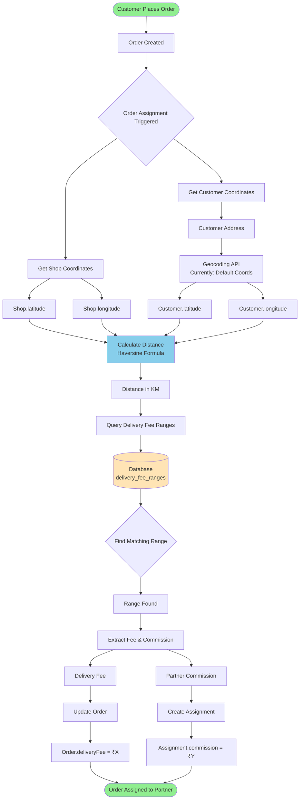

# Delivery Fee Calculation Flow Diagram

## 📊 System Architecture Flow



## 🔄 Detailed Component Flow

```
┌─────────────────────────────────────────────────────────────────────┐
│                         ORDER PLACEMENT                              │
├─────────────────────────────────────────────────────────────────────┤
│  Customer                                                            │
│     ↓                                                               │
│  Places Order with Delivery Address                                 │
│     ↓                                                               │
│  Order Created (Status: PENDING)                                    │
└─────────────────────────────────────────────────────────────────────┘
                                ↓
┌─────────────────────────────────────────────────────────────────────┐
│                     DISTANCE CALCULATION                             │
├─────────────────────────────────────────────────────────────────────┤
│  ┌──────────────────┐        ┌──────────────────┐                  │
│  │   Shop Location  │        │ Customer Location │                  │
│  ├──────────────────┤        ├──────────────────┤                  │
│  │ Lat: 13.0827    │        │ Lat: 12.9716      │                  │
│  │ Lon: 80.2707    │        │ Lon: 77.5946      │                  │
│  └────────┬─────────┘        └────────┬─────────┘                  │
│           └──────────┬────────────────┘                            │
│                      ↓                                              │
│         ┌─────────────────────────┐                                │
│         │   Haversine Formula     │                                │
│         │   Distance = 290 km     │                                │
│         └─────────────────────────┘                                │
└─────────────────────────────────────────────────────────────────────┘
                                ↓
┌─────────────────────────────────────────────────────────────────────┐
│                    FEE RANGE LOOKUP                                  │
├─────────────────────────────────────────────────────────────────────┤
│  Database Query:                                                     │
│  SELECT * FROM delivery_fee_ranges                                  │
│  WHERE 290 BETWEEN min_distance_km AND max_distance_km             │
│  AND is_active = true;                                              │
│                                                                      │
│  ┌────────────────────────────────────────────────┐                │
│  │ Range ID │ Min KM │ Max KM │ Fee │ Commission  │                │
│  ├────────────────────────────────────────────────┤                │
│  │    1     │   0    │   5    │ 20  │     15     │                │
│  │    2     │   5    │   10   │ 40  │     30     │                │
│  │    3     │   10   │   20   │ 60  │     45     │                │
│  │    4     │   20   │   ∞    │ 100 │     75     │ ← SELECTED     │
│  └────────────────────────────────────────────────┘                │
└─────────────────────────────────────────────────────────────────────┘
                                ↓
┌─────────────────────────────────────────────────────────────────────┐
│                    FEE ASSIGNMENT                                    │
├─────────────────────────────────────────────────────────────────────┤
│  ┌──────────────────┐        ┌──────────────────┐                  │
│  │      Order       │        │  Order Assignment │                  │
│  ├──────────────────┤        ├──────────────────┤                  │
│  │ Delivery Fee:    │        │ Partner ID: 123   │                  │
│  │     ₹100        │        │ Commission: ₹75   │                  │
│  └──────────────────┘        └──────────────────┘                  │
└─────────────────────────────────────────────────────────────────────┘
                                ↓
┌─────────────────────────────────────────────────────────────────────┐
│                    FINAL RESULT                                      │
├─────────────────────────────────────────────────────────────────────┤
│  Customer Pays: ₹100 (Delivery Fee)                                 │
│  Partner Earns: ₹75 (Commission)                                    │
│  Platform Keeps: ₹25 (Difference)                                   │
└─────────────────────────────────────────────────────────────────────┘
```

## 📋 Key Classes and Methods

```
┌─────────────────────────────────────────┐
│         OrderAssignmentService          │
├─────────────────────────────────────────┤
│ + assignOrderToDeliveryPartner()        │
│ + calculateOrderDistance()              │
│ + calculateDeliveryCommission()         │
└─────────────────────────────────────────┘
                    ↓
┌─────────────────────────────────────────┐
│          DeliveryFeeService             │
├─────────────────────────────────────────┤
│ + calculateDistance()                   │
│ + calculateDeliveryFee()                │
│ + calculatePartnerCommission()          │
└─────────────────────────────────────────┘
                    ↓
┌─────────────────────────────────────────┐
│      DeliveryFeeRangeRepository         │
├─────────────────────────────────────────┤
│ + findByDistanceRange()                 │
│ + findByIsActiveTrueOrderByMinDistance()│
└─────────────────────────────────────────┘
```

## 🔢 Sample Calculations

| Distance | Range Selected | Delivery Fee | Partner Gets | Platform Gets |
|----------|---------------|--------------|--------------|---------------|
| 3 km     | 0-5 km       | ₹20          | ₹15         | ₹5           |
| 7 km     | 5-10 km      | ₹40          | ₹30         | ₹10          |
| 15 km    | 10-20 km     | ₹60          | ₹45         | ₹15          |
| 290 km   | 20+ km       | ₹100         | ₹75         | ₹25          |

## 🎯 Process Summary

1. **INPUT**: Shop Location + Customer Location
2. **CALCULATION**: Distance (Haversine Formula)
3. **LOOKUP**: Find matching range in database
4. **OUTPUT**: Delivery Fee + Partner Commission
5. **ASSIGNMENT**: Update Order & Create Assignment

## 📝 Implementation Files

- **Backend**:
  - `/backend/src/main/java/com/shopmanagement/service/OrderAssignmentService.java`
  - `/backend/src/main/java/com/shopmanagement/service/DeliveryFeeService.java`
  - `/backend/src/main/java/com/shopmanagement/entity/DeliveryFeeRange.java`
  - `/backend/src/main/java/com/shopmanagement/repository/DeliveryFeeRangeRepository.java`

- **Database**:
  - Table: `delivery_fee_ranges`
  - Migration: `V15__Create_delivery_fee_ranges_table.sql`

- **Admin Interface**:
  - `/frontend/src/app/features/admin/components/delivery-fee-management/`
  - Super Admin Access Only