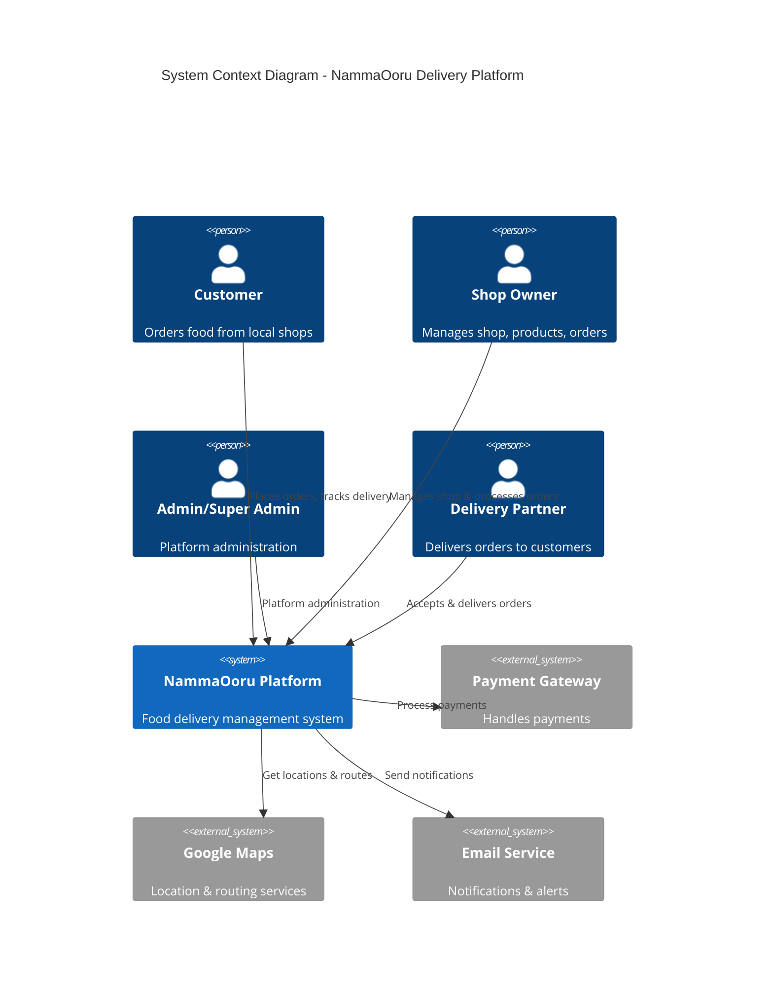
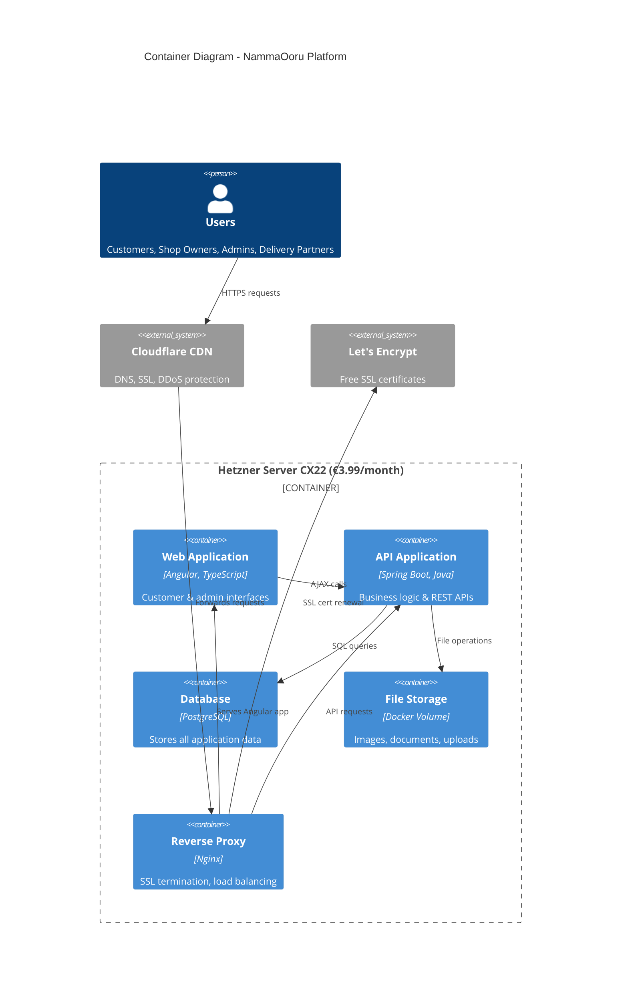
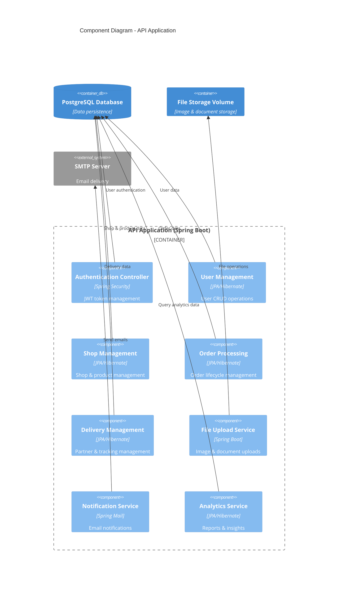
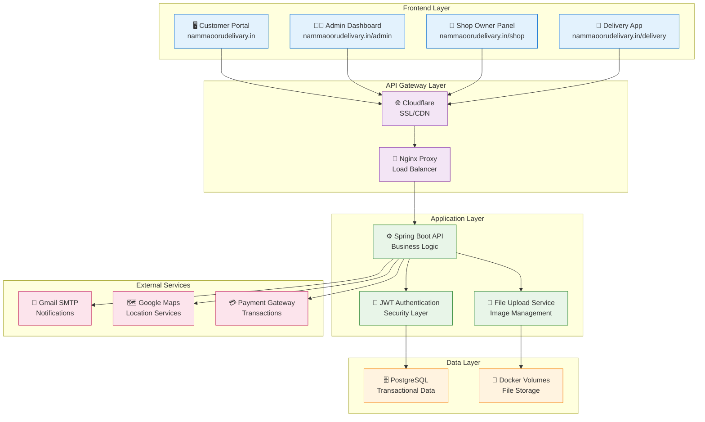
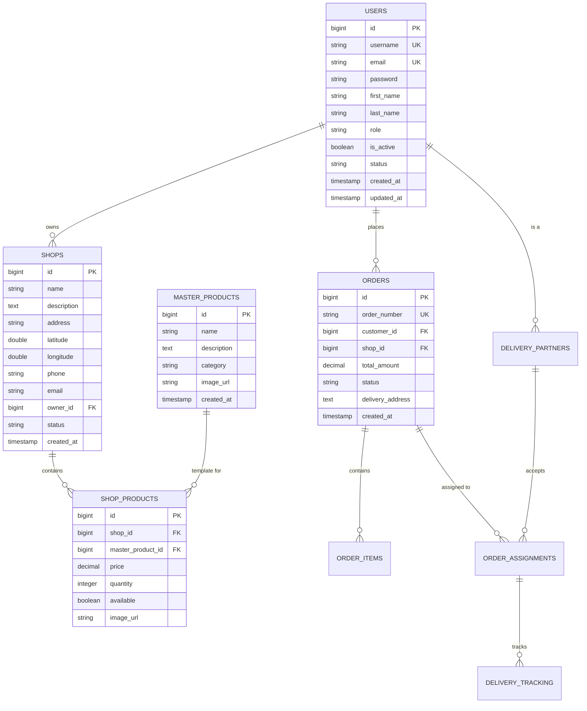
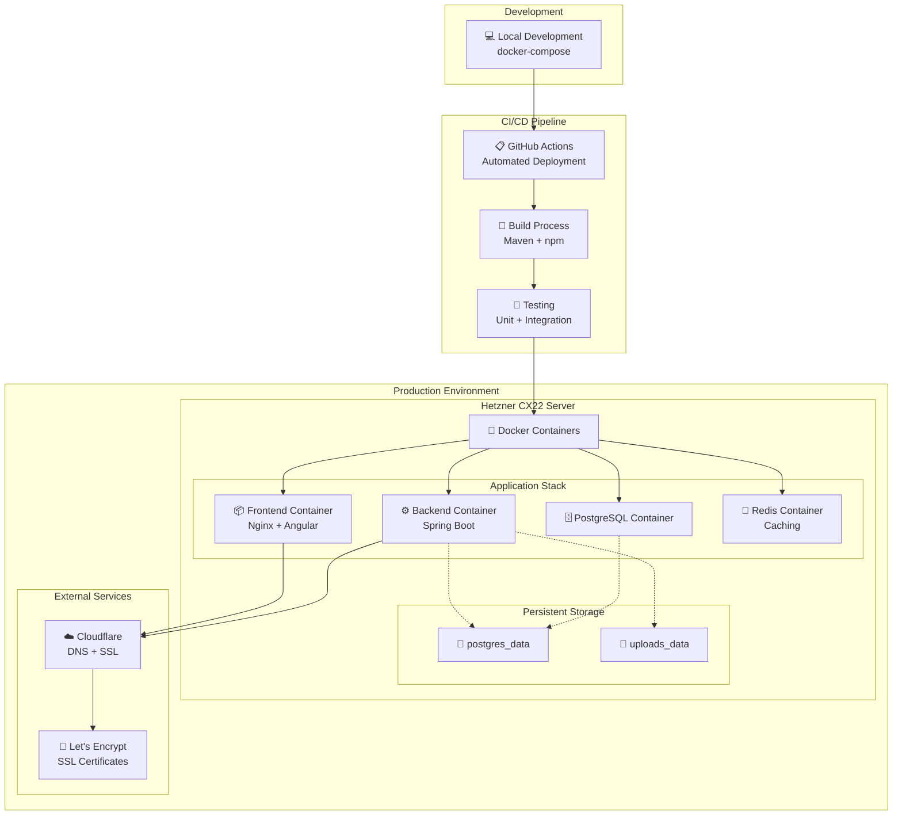
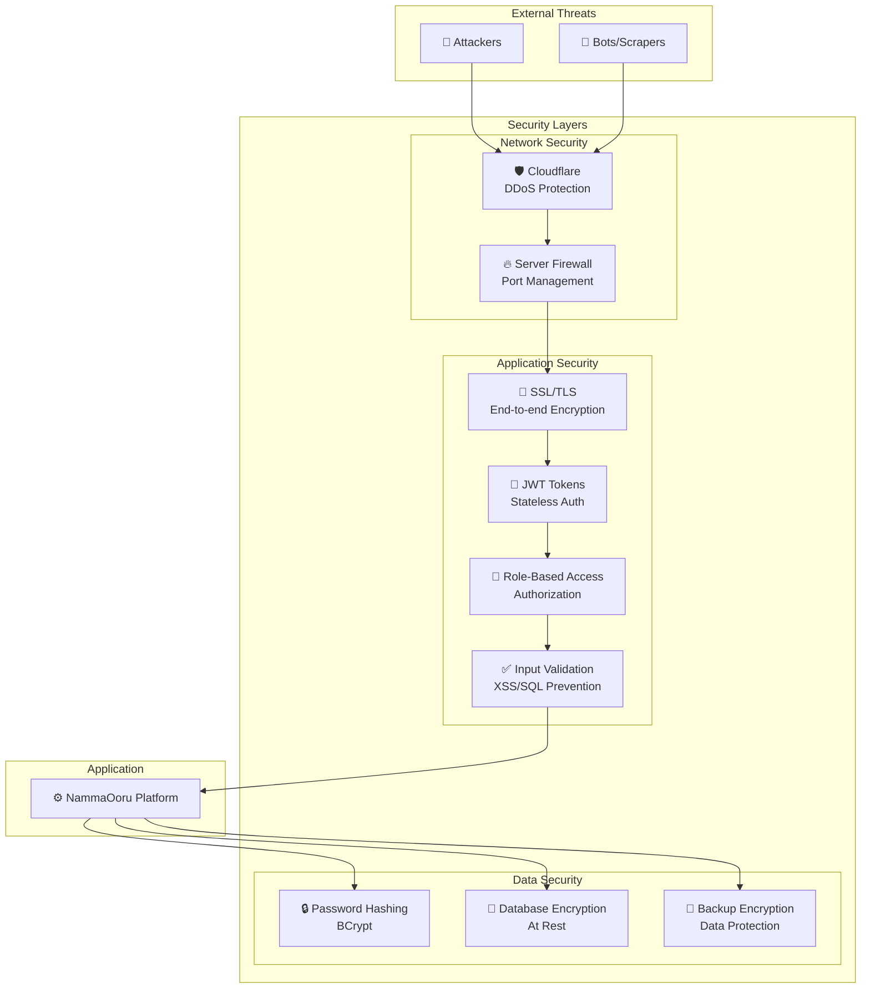
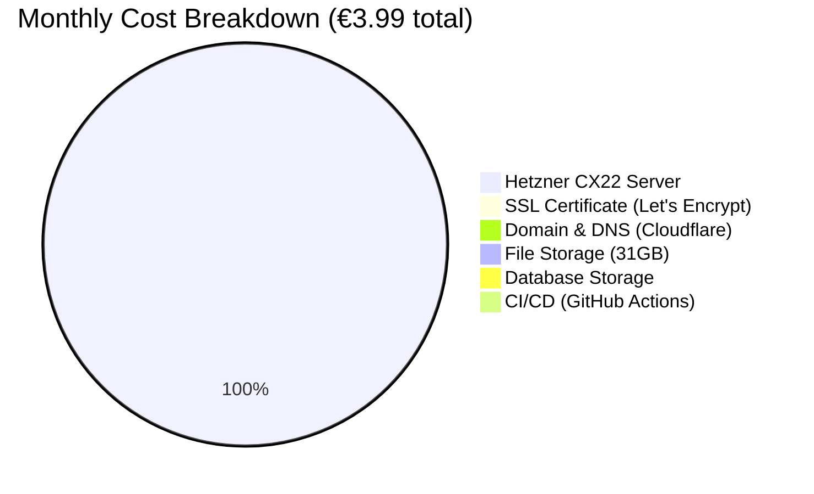
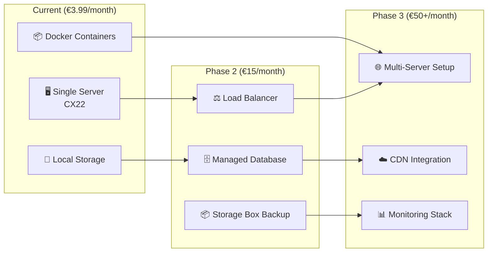

# NammaOoru Delivery - Complete Application Architecture

## High-Level System Architecture

## Container Architecture

## Component Architecture

## Data Flow Architecture

## Database Schema Overview

## Deployment Architecture

## Security Architecture

## Cost Architecture

## Scalability Roadmap

---

**This architecture supports:**
- ✅ **Multi-tenant**: Customers, Shop Owners, Admins, Delivery Partners
- ✅ **Scalable**: From startup to enterprise
- ✅ **Cost-effective**: €3.99/month starting cost
- ✅ **Secure**: Multiple security layers
- ✅ **Maintainable**: Modern tech stack with CI/CD