# NammaOoru Delivery - Complete Application Architecture

## High-Level System Architecture

## Container Architecture

## Component Architecture

## Data Flow Architecture

```mermaid
graph TB
    subgraph "Frontend Layer"
        A1[🖥️ Customer Portal<br/>nammaoorudelivary.in]
        A2[👨‍💼 Admin Dashboard<br/>nammaoorudelivary.in/admin]
        A3[🏪 Shop Owner Panel<br/>nammaoorudelivary.in/shop]
        A4[🚚 Delivery App<br/>nammaoorudelivary.in/delivery]
    end

    subgraph "API Gateway Layer"
        B1[🌐 Cloudflare<br/>SSL/CDN]
        B2[🔀 Nginx Proxy<br/>Load Balancer]
    end

    subgraph "Application Layer"
        C1[⚙️ Spring Boot API<br/>Business Logic]
        C2[🔐 JWT Authentication<br/>Security Layer]
        C3[📁 File Upload Service<br/>Image Management]
    end

    subgraph "Data Layer"
        D1[🗄️ PostgreSQL<br/>Transactional Data]
        D2[📂 Docker Volumes<br/>File Storage]
    end

    subgraph "External Services"
        E1[📧 Gmail SMTP<br/>Notifications]
        E2[🗺️ Google Maps<br/>Location Services]
        E3[💳 Payment Gateway<br/>Transactions]
    end

    %% Connections
    A1 --> B1
    A2 --> B1
    A3 --> B1
    A4 --> B1
    
    B1 --> B2
    B2 --> C1
    
    C1 --> C2
    C1 --> C3
    C2 --> D1
    C3 --> D2
    
    C1 --> E1
    C1 --> E2
    C1 --> E3

    %% Styling
    classDef frontend fill:#e3f2fd,stroke:#1976d2
    classDef gateway fill:#f3e5f5,stroke:#7b1fa2
    classDef application fill:#e8f5e8,stroke:#388e3c
    classDef data fill:#fff3e0,stroke:#f57c00
    classDef external fill:#fce4ec,stroke:#c2185b

    class A1,A2,A3,A4 frontend
    class B1,B2 gateway
    class C1,C2,C3 application
    class D1,D2 data
    class E1,E2,E3 external
```

## Database Schema Overview

## Deployment Architecture

```mermaid
graph TB
    subgraph "Development"
        DEV[💻 Local Development<br/>docker-compose]
    end
    
    subgraph "CI/CD Pipeline"
        GH[📋 GitHub Actions<br/>Automated Deployment]
        BUILD[🔨 Build Process<br/>Maven + npm]
        TEST[🧪 Testing<br/>Unit + Integration]
    end
    
    subgraph "Production Environment"
        subgraph "Hetzner CX22 Server"
            DOCKER[🐳 Docker Containers]
            subgraph "Application Stack"
                FE_PROD[📦 Frontend Container<br/>Nginx + Angular]
                BE_PROD[⚙️ Backend Container<br/>Spring Boot]
                DB_PROD[🗄️ PostgreSQL Container]
                REDIS_PROD[🔴 Redis Container<br/>Caching]
            end
            subgraph "Persistent Storage"
                DB_VOL[💾 postgres_data]
                UP_VOL[📁 uploads_data]
            end
        end
        
        subgraph "External Services"
            CF[☁️ Cloudflare<br/>DNS + SSL]
            LE[🔐 Let's Encrypt<br/>SSL Certificates]
        end
    end
    
    DEV --> GH
    GH --> BUILD
    BUILD --> TEST
    TEST --> DOCKER
    
    DOCKER --> FE_PROD
    DOCKER --> BE_PROD
    DOCKER --> DB_PROD
    DOCKER --> REDIS_PROD
    
    BE_PROD -.-> DB_VOL
    BE_PROD -.-> UP_VOL
    DB_PROD -.-> DB_VOL
    
    FE_PROD --> CF
    BE_PROD --> CF
    CF --> LE
```

## Security Architecture

```mermaid
graph TB
    subgraph "External Threats"
        AT[🎯 Attackers]
        BOT[🤖 Bots/Scrapers]
    end
    
    subgraph "Security Layers"
        subgraph "Network Security"
            CF[🛡️ Cloudflare<br/>DDoS Protection]
            FW[🔥 Server Firewall<br/>Port Management]
        end
        
        subgraph "Application Security"
            SSL[🔐 SSL/TLS<br/>End-to-end Encryption]
            JWT[🎫 JWT Tokens<br/>Stateless Auth]
            RBAC[👮 Role-Based Access<br/>Authorization]
            VAL[✅ Input Validation<br/>XSS/SQL Prevention]
        end
        
        subgraph "Data Security"
            HASH[🔒 Password Hashing<br/>BCrypt]
            ENC[🔐 Database Encryption<br/>At Rest]
            BAK[💾 Backup Encryption<br/>Data Protection]
        end
    end
    
    subgraph "Application"
        APP[⚙️ NammaOoru Platform]
    end
    
    AT --> CF
    BOT --> CF
    CF --> FW
    FW --> SSL
    SSL --> JWT
    JWT --> RBAC
    RBAC --> VAL
    VAL --> APP
    APP --> HASH
    APP --> ENC
    APP --> BAK
```

## Cost Architecture

```mermaid
pie title Monthly Cost Breakdown (€3.99 total)
    "Hetzner CX22 Server" : 3.99
    "SSL Certificate (Let's Encrypt)" : 0
    "Domain & DNS (Cloudflare)" : 0  
    "File Storage (31GB)" : 0
    "Database Storage" : 0
    "CI/CD (GitHub Actions)" : 0
```

## Scalability Roadmap

```mermaid
graph LR
    subgraph "Current (€3.99/month)"
        C1[🖥️ Single Server<br/>CX22]
        C2[📦 Docker Containers]
        C3[💾 Local Storage]
    end
    
    subgraph "Phase 2 (€15/month)"
        P1[⚖️ Load Balancer]
        P2[🗄️ Managed Database]
        P3[📦 Storage Box Backup]
    end
    
    subgraph "Phase 3 (€50+/month)"
        P4[🌐 Multi-Server Setup]
        P5[☁️ CDN Integration]
        P6[📊 Monitoring Stack]
    end
    
    C1 --> P1
    C2 --> P4
    C3 --> P2
    P1 --> P4
    P2 --> P5
    P3 --> P6
```

---

**This architecture supports:**
- ✅ **Multi-tenant**: Customers, Shop Owners, Admins, Delivery Partners
- ✅ **Scalable**: From startup to enterprise
- ✅ **Cost-effective**: €3.99/month starting cost
- ✅ **Secure**: Multiple security layers
- ✅ **Maintainable**: Modern tech stack with CI/CD