# Image Upload Architecture Diagram

## System Overview

```mermaid
graph TB
    subgraph "User Interface"
        U1[👤 Shop Owner]
        U2[👤 Admin User]
        U3[👤 Customer]
    end

    subgraph "Frontend (Angular)"
        FE[🌐 Angular App<br/>nammaoorudelivary.in]
        UP[📤 Upload Component]
        GI[🖼️ Gallery Component]
    end

    subgraph "Load Balancer & SSL"
        CF[☁️ Cloudflare<br/>SSL Termination]
        NX[🔀 Nginx<br/>Reverse Proxy]
    end

    subgraph "Hetzner Server CX22 (€3.99/month)"
        subgraph "Docker Network"
            subgraph "Backend Container"
                BE[⚙️ Spring Boot API<br/>Port 8082]
                UC[📁 Upload Controller]
                FS[💾 File Service]
            end
            
            subgraph "Frontend Container"
                FEC[📦 Nginx Container<br/>Port 8080]
            end
            
            subgraph "Database Container"
                DB[🗄️ PostgreSQL<br/>Port 5432]
            end
        end
        
        subgraph "Persistent Storage (31GB Available)"
            UV[📂 uploads_data Volume<br/>/var/lib/docker/volumes/]
            subgraph "Organized Folders"
                PI[📸 products/images/]
                PT[🖼️ products/thumbnails/]
                SL[🏪 shops/logos/]
                SB[🎨 shops/banners/]
                UA[👤 users/avatars/]
                DV[📄 documents/verification/]
            end
        end
    end

    %% User Flow
    U1 --> FE
    U2 --> FE
    U3 --> FE
    
    %% Frontend Flow
    FE --> UP
    FE --> GI
    UP --> CF
    GI --> CF
    
    %% SSL & Load Balancing
    CF --> NX
    NX --> BE
    NX --> FEC
    
    %% Backend Processing
    BE --> UC
    UC --> FS
    FS --> UV
    
    %% Database Integration
    BE --> DB
    
    %% Storage Organization
    UV --> PI
    UV --> PT
    UV --> SL
    UV --> SB
    UV --> UA
    UV --> DV

    %% Styling
    classDef userClass fill:#e1f5fe,stroke:#01579b,stroke-width:2px
    classDef frontendClass fill:#f3e5f5,stroke:#4a148c,stroke-width:2px
    classDef backendClass fill:#e8f5e8,stroke:#1b5e20,stroke-width:2px
    classDef storageClass fill:#fff3e0,stroke:#e65100,stroke-width:2px
    classDef networkClass fill:#fce4ec,stroke:#880e4f,stroke-width:2px

    class U1,U2,U3 userClass
    class FE,UP,GI,FEC frontendClass
    class BE,UC,FS,DB backendClass
    class UV,PI,PT,SL,SB,UA,DV storageClass
    class CF,NX networkClass
```

## Upload Flow Sequence

```mermaid
sequenceDiagram
    participant U as 👤 User
    participant F as 🌐 Frontend
    participant N as 🔀 Nginx
    participant B as ⚙️ Backend API
    participant S as 💾 Storage Volume
    participant D as 🗄️ Database

    Note over U,D: Image Upload Process

    U->>F: 1. Select Image File
    F->>F: 2. Validate File (size, type)
    F->>N: 3. POST /api/upload (multipart)
    N->>B: 4. Forward to Backend
    
    B->>B: 5. Validate Upload Request
    B->>B: 6. Generate Unique Filename
    B->>S: 7. Save to /app/uploads/products/images/
    B->>D: 8. Store File Metadata
    
    B->>N: 9. Return Image URL
    N->>F: 10. Response: {"url": "https://api.../uploads/..."}
    F->>U: 11. Display Success + Preview
    
    Note over U,D: Image Access Process
    
    U->>F: 12. View Product/Shop
    F->>N: 13. GET /uploads/products/images/file.jpg
    N->>B: 14. Serve Static File
    B->>S: 15. Read from Volume
    S->>B: 16. File Data
    B->>N: 17. Stream Image
    N->>F: 18. Image Response
    F->>U: 19. Display Image
```

## Storage Architecture

```mermaid
graph LR
    subgraph "Physical Layer"
        HDD[💿 Hetzner SSD<br/>60GB Total<br/>31GB Available]
    end
    
    subgraph "Docker Layer"
        DV[📦 Docker Volume<br/>uploads_data<br/>Persistent Storage]
    end
    
    subgraph "Application Layer"
        APP[🔗 Container Mount<br/>/app/uploads/]
    end
    
    subgraph "File Organization"
        direction TB
        PRD[📸 products/<br/>- images/<br/>- thumbnails/]
        SHP[🏪 shops/<br/>- logos/<br/>- banners/]
        USR[👤 users/<br/>- avatars/]
        DOC[📄 documents/<br/>- verification/]
        TMP[🗑️ temp/<br/>- processing/]
    end
    
    HDD --> DV
    DV --> APP
    APP --> PRD
    APP --> SHP
    APP --> USR
    APP --> DOC
    APP --> TMP
```

## API Endpoints

| Method | Endpoint | Description | Storage Location |
|--------|----------|-------------|------------------|
| `POST` | `/api/upload/product` | Upload product image | `/products/images/` |
| `POST` | `/api/upload/shop-logo` | Upload shop logo | `/shops/logos/` |
| `POST` | `/api/upload/avatar` | Upload user avatar | `/users/avatars/` |
| `POST` | `/api/upload/document` | Upload verification docs | `/documents/verification/` |
| `GET` | `/uploads/**` | Serve uploaded files | Direct file access |

## Security & Validation

```mermaid
graph TD
    UF[📁 User File] --> VS[✅ Size Validation<br/>Max: 10MB]
    VS --> VT[✅ Type Validation<br/>jpg,png,gif,webp,pdf]
    VT --> VN[✅ Name Sanitization<br/>Remove dangerous chars]
    VN --> AU[🔐 User Authentication<br/>JWT Token Required]
    AU --> AZ[🛡️ Authorization<br/>Role-based Access]
    AZ --> UV[🔒 Unique Filename<br/>Prevent Conflicts]
    UV --> SS[💾 Secure Storage<br/>Organized Folders]
    SS --> FU[🌐 File URL<br/>HTTPS Access]
```

## Cost Analysis

| Component | Storage | Cost | Usage |
|-----------|---------|------|-------|
| **Hetzner CX22 Server** | 60GB Total | €3.99/month | Base infrastructure |
| **Docker Volumes** | 31GB Available | €0 extra | Image storage |
| **SSL Certificate** | N/A | €0 (Let's Encrypt) | HTTPS security |
| **Nginx Reverse Proxy** | N/A | €0 | Load balancing |
| **Image Processing** | CPU/Memory | €0 extra | Included in server |
| **Total Image Storage** | **31GB** | **€0 additional** | **~62,000 images** |

## Backup Strategy (Optional)

```mermaid
graph TB
    subgraph "Production Storage"
        PS[💾 uploads_data Volume<br/>Fast SSD Access]
    end
    
    subgraph "Backup Options"
        B1[📦 Hetzner Storage Box<br/>1TB - €3.20/month]
        B2[☁️ Cloud Storage<br/>AWS S3/Google Cloud]
        B3[💿 Local Backup<br/>pg_dump + tar]
    end
    
    PS -.-> B1
    PS -.-> B2
    PS -.-> B3
    
    style B1 fill:#e8f5e8
    style B2 fill:#fff3e0
    style B3 fill:#f3e5f5
```

## Performance Metrics

- **Upload Speed**: ~50-100MB/s (SSD limited)
- **Access Speed**: Direct disk access (fastest possible)
- **Concurrent Uploads**: Limited by server resources
- **Storage Capacity**: 31GB (~62,000 typical product images)
- **Availability**: 99.9% (Hetzner SLA)

## Deployment Safety

✅ **Images persist through:**
- CI/CD deployments
- Container restarts
- Docker Compose rebuilds
- Server reboots

❌ **Images lost only if:**
- Manual volume deletion (`docker volume rm`)
- Physical disk failure (rare)
- Explicit file deletion

---
*Architecture designed for Hetzner CX22 server with Docker deployment*