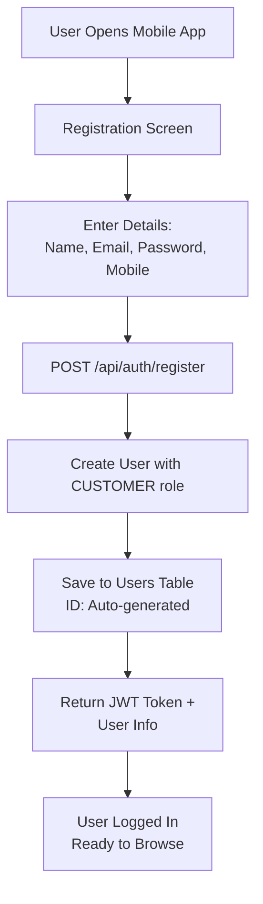
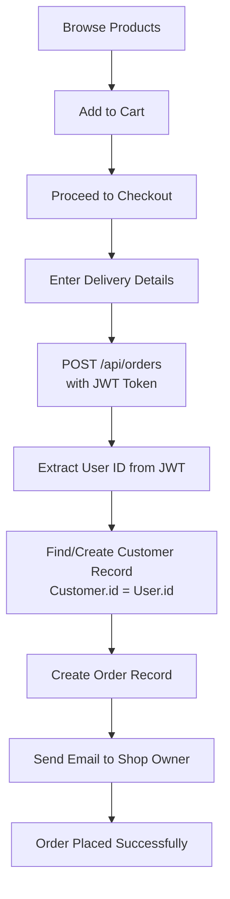

# 🏗️ Nammaooru Thiru Software System - Architecture Design

## 📋 Table of Contents
1. [System Overview](#system-overview)
2. [User Role Management](#user-role-management)
3. [Database Schema](#database-schema)
4. [Mobile App Flow](#mobile-app-flow)
5. [Order Processing Workflow](#order-processing-workflow)
6. [API Endpoints](#api-endpoints)
7. [Permission Matrix](#permission-matrix)

---

## 🎯 System Overview

The Nammaooru Thiru Software System is a comprehensive e-commerce platform that connects customers, shop owners, and delivery partners through a unified system.

### Key Components:
- **Backend**: Spring Boot REST API
- **Mobile App**: Flutter (Android/iOS)
- **Web Dashboard**: Angular (Shop Owner Interface)
- **Database**: PostgreSQL
- **Authentication**: JWT Token-based

---

## 👥 User Role Management

### Role Hierarchy:
```
SUPER_ADMIN
    ├── ADMIN
    ├── SHOP_OWNER
    ├── MANAGER
    ├── EMPLOYEE
    ├── CUSTOMER_SERVICE
    ├── DELIVERY_PARTNER
    └── CUSTOMER (Mobile App Users)
        └── USER (Legacy/Web Users)
```

### Role Definitions:

#### 🛡️ SUPER_ADMIN
- **Purpose**: System administration
- **Access**: Full system access
- **Users**: System administrators

#### 🏪 SHOP_OWNER
- **Purpose**: Manage individual shops
- **Access**: Shop management, order processing
- **Users**: Shop proprietors

#### 📱 CUSTOMER
- **Purpose**: Mobile app end users
- **Access**: Browse products, place orders, track deliveries
- **Users**: Mobile app customers

#### 🚚 DELIVERY_PARTNER
- **Purpose**: Handle order deliveries
- **Access**: View assigned orders, update delivery status
- **Users**: Delivery personnel

---

## 🗄️ Database Schema

### Primary Tables:

#### USERS Table (Authentication)
```sql
CREATE TABLE users (
    id BIGSERIAL PRIMARY KEY,
    username VARCHAR(50) UNIQUE NOT NULL,
    email VARCHAR(100) UNIQUE NOT NULL,
    password VARCHAR(255) NOT NULL,
    first_name VARCHAR(100),
    last_name VARCHAR(100),
    mobile_number VARCHAR(15),
    role VARCHAR(20) NOT NULL DEFAULT 'USER',
    status VARCHAR(20) NOT NULL DEFAULT 'ACTIVE',
    email_verified BOOLEAN DEFAULT FALSE,
    mobile_verified BOOLEAN DEFAULT FALSE,
    created_at TIMESTAMP DEFAULT CURRENT_TIMESTAMP,
    updated_at TIMESTAMP DEFAULT CURRENT_TIMESTAMP
);
```

#### CUSTOMERS Table (Order Management)
```sql
CREATE TABLE customers (
    id BIGSERIAL PRIMARY KEY,
    first_name VARCHAR(100) NOT NULL,
    last_name VARCHAR(100) NOT NULL,
    email VARCHAR(100) UNIQUE NOT NULL,
    mobile_number VARCHAR(15) NOT NULL,
    address_line1 VARCHAR(200),
    city VARCHAR(100),
    state VARCHAR(100),
    postal_code VARCHAR(20),
    country VARCHAR(100) DEFAULT 'India',
    is_active BOOLEAN DEFAULT TRUE,
    total_orders INTEGER DEFAULT 0,
    total_spent DECIMAL(10,2) DEFAULT 0.00,
    created_at TIMESTAMP DEFAULT CURRENT_TIMESTAMP,
    updated_at TIMESTAMP DEFAULT CURRENT_TIMESTAMP
);
```

#### ORDERS Table
```sql
CREATE TABLE orders (
    id BIGSERIAL PRIMARY KEY,
    order_number VARCHAR(50) UNIQUE NOT NULL,
    customer_id BIGINT REFERENCES customers(id),
    shop_id BIGINT REFERENCES shops(id),
    status VARCHAR(50) NOT NULL DEFAULT 'PENDING',
    payment_status VARCHAR(50) NOT NULL DEFAULT 'PENDING',
    payment_method VARCHAR(50) NOT NULL,
    subtotal DECIMAL(10,2) NOT NULL,
    tax_amount DECIMAL(10,2) DEFAULT 0.00,
    delivery_fee DECIMAL(10,2) DEFAULT 0.00,
    discount_amount DECIMAL(10,2) DEFAULT 0.00,
    total_amount DECIMAL(10,2) NOT NULL,
    delivery_address TEXT NOT NULL,
    delivery_city VARCHAR(100),
    delivery_state VARCHAR(100),
    delivery_postal_code VARCHAR(20),
    delivery_phone VARCHAR(15),
    delivery_contact_name VARCHAR(200),
    notes TEXT,
    created_at TIMESTAMP DEFAULT CURRENT_TIMESTAMP,
    updated_at TIMESTAMP DEFAULT CURRENT_TIMESTAMP,
    created_by VARCHAR(100),
    updated_by VARCHAR(100)
);
```

---

## 📱 Mobile App Flow

### Registration Process:


### Order Placement Process:


---

## ⚙️ Order Processing Workflow

### Customer Journey:
```
1. PLACEMENT
   📱 Mobile App → JWT Token → User ID → Customer ID → Order Created

2. NOTIFICATION
   📧 Email sent to Shop Owner with order details

3. SHOP OWNER RESPONSE
   ✅ Accept Order → Status: CONFIRMED → Customer notified
   ❌ Reject Order → Status: CANCELLED → Customer notified

4. FULFILLMENT
   🏪 Shop prepares order → Status: PREPARING
   📦 Order ready → Status: READY_FOR_PICKUP
   🚚 Out for delivery → Status: OUT_FOR_DELIVERY
   ✅ Delivered → Status: DELIVERED
```

### Status Flow:
```
PENDING → CONFIRMED → PREPARING → READY_FOR_PICKUP → OUT_FOR_DELIVERY → DELIVERED
    ↓
CANCELLED (if rejected)
```

---

## 🔌 API Endpoints

### Authentication Endpoints:
```http
POST /api/auth/register          # User registration (Creates CUSTOMER role)
POST /api/auth/login             # User login
POST /api/auth/logout            # User logout
```

### Order Management Endpoints:
```http
POST   /api/orders               # Place new order
GET    /api/orders/{id}          # Get order details
PUT    /api/orders/{id}/status   # Update order status
POST   /api/orders/{id}/accept   # Shop owner accepts order
POST   /api/orders/{id}/reject   # Shop owner rejects order
POST   /api/orders/{id}/cancel   # Cancel order
GET    /api/orders/{id}/tracking # Track order
```

### Shop & Product Endpoints:
```http
GET    /api/shops                # Get all shops
GET    /api/shops/{id}           # Get shop details
GET    /api/shops/{id}/products  # Get shop products
```

### Customer Endpoints:
```http
GET    /api/customers            # Get all customers
POST   /api/customers            # Create customer
PUT    /api/customers/{id}       # Update customer
```

---

## 🔐 Permission Matrix

| API Endpoint | CUSTOMER | USER | SHOP_OWNER | ADMIN | DELIVERY_PARTNER |
|-------------|----------|------|------------|-------|------------------|
| **Authentication** |
| POST /api/auth/register | ✅ | ✅ | ✅ | ✅ | ✅ |
| POST /api/auth/login | ✅ | ✅ | ✅ | ✅ | ✅ |
| **Orders** |
| POST /api/orders | ✅ | ✅ | ✅ | ✅ | ❌ |
| GET /api/orders/{id} | ✅ | ✅ | ✅ | ✅ | ✅ |
| POST /api/orders/{id}/accept | ❌ | ❌ | ✅ | ✅ | ❌ |
| POST /api/orders/{id}/reject | ❌ | ❌ | ✅ | ✅ | ❌ |
| POST /api/orders/{id}/cancel | ✅ | ✅ | ✅ | ✅ | ❌ |
| **Shops & Products** |
| GET /api/shops | ✅ | ✅ | ✅ | ✅ | ✅ |
| GET /api/shops/{id}/products | ✅ | ✅ | ✅ | ✅ | ✅ |
| POST /api/shops | ❌ | ❌ | ✅ | ✅ | ❌ |
| **Customers** |
| GET /api/customers | ❌ | ❌ | ✅ | ✅ | ❌ |
| POST /api/customers | ✅ | ✅ | ❌ | ✅ | ❌ |

---

## 🔄 Key Relationships

### User-Customer Relationship:
```
USER TABLE (Authentication)    CUSTOMER TABLE (Orders)
┌─────────────────┐           ┌─────────────────┐
│ id: 212         │    ═══    │ id: 212         │
│ role: CUSTOMER  │    1:1    │ (same ID)       │
│ email: u@e.com  │ (linked)  │ email: u@e.com  │
│ password: ***   │           │ orders: [...]   │
└─────────────────┘           └─────────────────┘
```

### Order-Customer-Shop Relationship:
```
CUSTOMER ──→ ORDER ──→ SHOP
   1:N       N:1       N:1
(many       (one      (one
orders)    customer)  shop)
```

---

## 🚀 Deployment Architecture

### Environment Structure:
```
PRODUCTION
├── Backend API Server (Spring Boot)
├── Database Server (PostgreSQL)
├── File Storage (Local/Cloud)
└── Email Service (SMTP)

MOBILE APP
├── Flutter Android APK
└── Flutter iOS IPA

WEB DASHBOARD
├── Angular Build
└── Static File Server
```

### Security Measures:
- JWT Token authentication
- Password encryption (BCrypt)
- Role-based access control
- Input validation
- SQL injection protection
- CORS configuration

---

## 📞 Integration Points

### Email Notifications:
- Order placed → Shop owner email
- Order accepted/rejected → Customer email
- Order status updates → Customer email

### Mobile Notifications:
- Firebase Cloud Messaging
- Push notifications for order updates
- In-app notification center

### Payment Integration:
- Cash on Delivery (Current)
- UPI/Digital payments (Future)
- Payment gateway integration ready

---

## 📈 Future Enhancements

### Planned Features:
1. **Real-time Order Tracking**
2. **Delivery Partner Mobile App**
3. **Inventory Management**
4. **Analytics Dashboard**
5. **Multi-language Support**
6. **Advanced Search & Filters**
7. **Loyalty Program**
8. **Bulk Order Management**

---

*This document outlines the complete system architecture for the Nammaooru Thiru Software System. For technical implementation details, refer to the individual service documentation.*